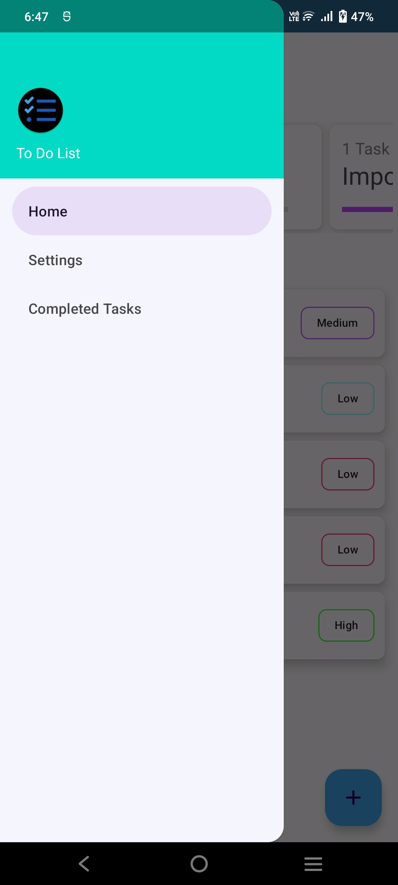
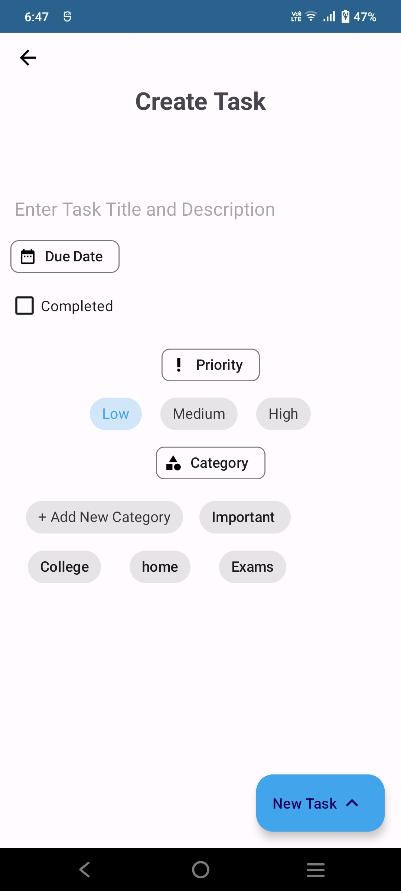
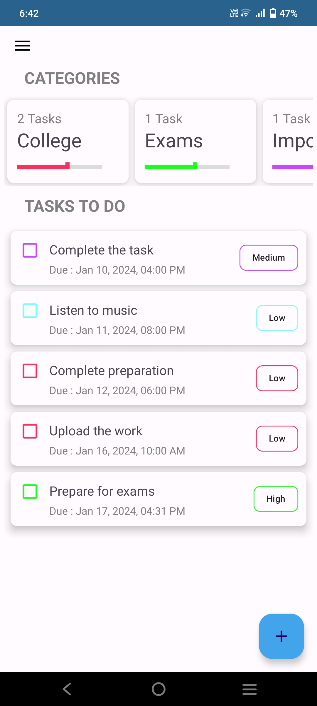
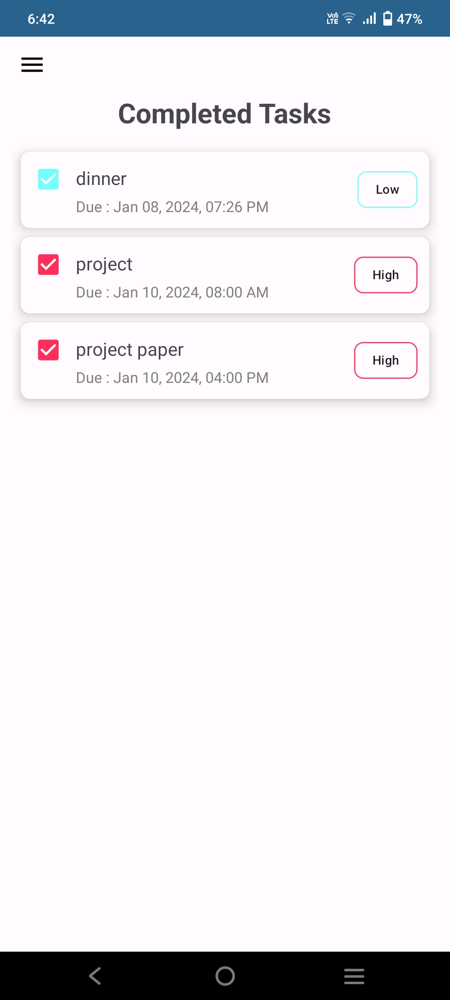
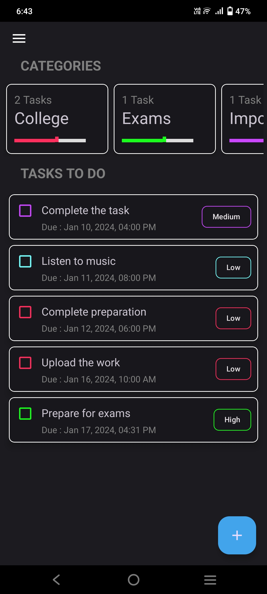
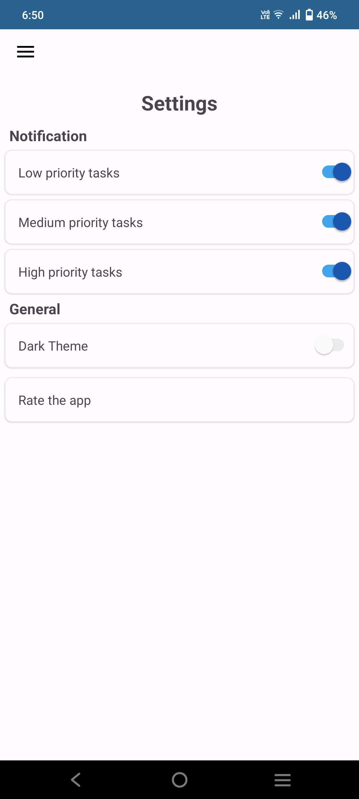

## Description of Project :

The described app is a To-Do List application designed for effective task management on Android. It features a clean and intuitive user interface with various functionalities to enhance the organization of tasks. Here's a brief description of the app's key features:

**Task Management:**

Users can create tasks with a title, detailed description, due date, priority level, and task status.
Each task is associated with a due date, allowing users to track upcoming deadlines.

**Priority Levels:**

Tasks can be assigned priority levels, categorized as Low, Medium, or High. This allows users to prioritize and focus on tasks accordingly.

**Categories:**

The app supports categorization of tasks, enabling users to group related tasks together for better organization.

**Local Storage:**

The application utilizes local storage, specifically SQLite through the Room Persistence Library, to save and retrieve tasks. This ensures data persistence and availability even after the app is closed.

**User-Friendly Interface:**

The user interface is designed to be simple and responsive, providing an easy-to-use experience for managing tasks efficiently.

**Adaptability:**

The application is built for the Android platform, making it compatible with a wide range of Android devices, both smartphones and tablets.

In summary, this To-Do List app is a comprehensive solution for users seeking a straightforward and feature-rich tool to organize and manage their tasks effectively, leveraging the capabilities of local storage and providing a visually pleasing user experience.

## Instructions on How to Set Up and Run the Application :

To set up and run the To-Do List application described earlier, you can follow these general instructions

### Prerequisites:

**Android Studio:**

Ensure you have Android Studio installed on your development machine.

**Git :**

If the project is hosted on a version control system like Git, you may need to clone the repository. Alternatively, you can download the project as a ZIP file.

### Setup Steps:

**Open Project in Android Studio:**

Open Android Studio.
Click on "Open an existing Android Studio project."
Navigate to the directory where you downloaded or cloned the project and select the project folder.

**Sync Project with Gradle Files:**

Android Studio may prompt you to sync the project with Gradle. Click on "Sync Now" if prompted.

**Build the Project:**

After syncing, click on the "Build" menu and select "Rebuild Project."

**Run the Application:**

Connect your Android device to your computer or use an emulator.
Click on the "Run" button (green triangle) in Android Studio.
Select your target device (physical device or emulator) and click "OK."

**Explore the App:**

Once the app is successfully installed and running, you can interact with it on the device/emulator.

### Screenshots :
  

